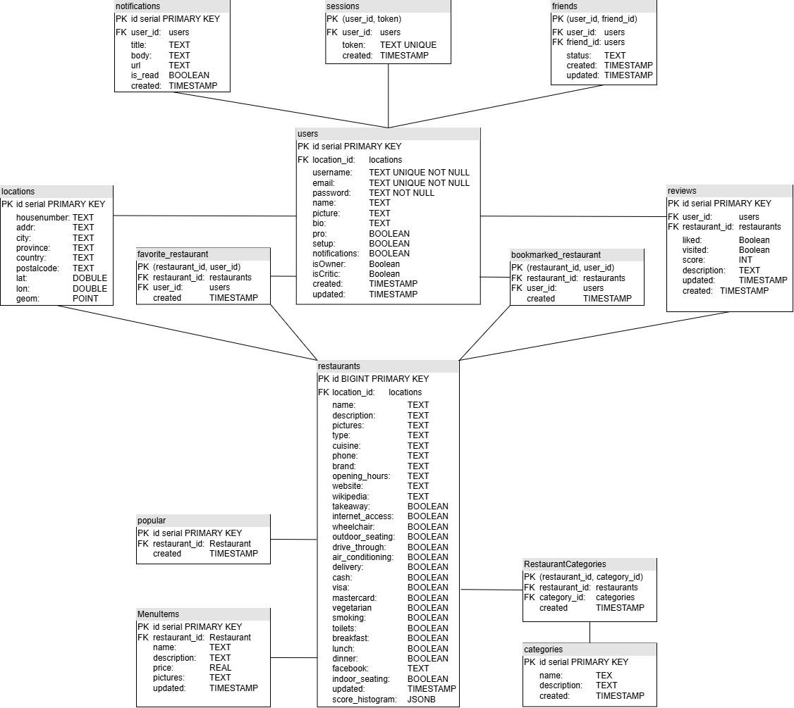

# Backend

# Endpoints
An end point in **BOLD** specifies it's implemented.

## Authentication
**POST /auth/register → Create a new user  
POST /auth/login → Authenticate a user and generate a session token  
POST /auth/logout → Invalidate the session token  
GET /auth/me → get logged in user info  
POST /auth/forgot-password → send an email with recovery code  
POST /auth/reset-password → reset password with one time code  
GET /auth/google → start oauth process  
GET /auth/google/callback → finish oauth process**

## Categories
**GET /categories → Get all categories   
GET /categories/:id → Get category details  
POST /categories → Create a new category**  

## Contributions
**GET /contributions → Get all contributions from logged in user  
GET /contributions/wishlists/:id → Get all contributions from wishlist  
GET /contributions/items/:id → Get contributions for an item  
POST /contributions → Add a contribution (given item_id)  
PUT /contributions/:id → Update a contribution (mark as purchased, etc.)  
DELETE /contributions/:id → Remove a contribution**  

##  Events
**GET /events → Get all events (for member)   
POST /events → Create a new event (makes you owner)  
GET /events/:id → Get event details (membership and wishlists too)  
PUT /events/:id → Update event  
DELETE /events/:id → Delete event**

**GET /events/:id/wishlists → Get wishlists for an event  
GET /events/:id/members → Get all members in a specific event   
POST /events/:id/members → Add a member to an event   
DELETE /events/:id/members → Remove a member from event    
PUT /events/:id/members → Update a members status (blind/owner)  
POST /events/members → add membership with share_token  
POST /events/share → share the event to email, if user exists membership added. Else send email**

## ideas
**GET / → Get all the ideas sorted by how much they relate to each person   
GET /trending → Get the top 6 most used items    
POST / → add a new idea (only for admins)    
POST /:ideaId/categories → add categories to an idea (only for admins)   
POST /upload/:itemId → upload new idea picture (only for admins)**  

## Items
**GET /items/:id → Get item details  
PUT /items/:id → Update a single item  
PUT /items → Update an array of items  
DELETE /items/:id → Remove an item   
POST /items -> create an item (given wishlists_id)  
POST /items -> add an idea to a wishlist (given wishlists_id and idea_id)   
POST /items/upload → upload a picture**

## Notifications
**GET /notifications → Get all notifications from logged in user  
PUT /notifications/:id → Edit a notifications (ex: is_read)   
DELETE /notifications/:id → Delete a notifications**  

## Payments
GET /payments/subscription → Get current users subscription status  
POST /payments/create-subscription-session → Get link to launch a checkout page  
POST /payments/create-portal-session → Get link to launch a manage subscription page  
POST /payments/reactivate-subscription → Reactivate subscription renewal  
POST /payments/cancel-subscription → Deactivate subscription renewal  
POST /payments/webhook → Performs actions depending on what stripe sends

## Status
GET /status → Get API status

## Users
**GET /users → Get logged in user profile and categories   
PUT /users → Update logged in user profile  
DELETE /users → Delete logged in user account  
GET /users/:id → Get specific user profile  
POST /users/upload → upload a profile picture**

**POST /users/categories/:categoryId → Assign a category to logged in user  
POST /users/categories → Assign an array of categories to logged in user  
Put /users/categories/:categoryId → updates a users love or hate value  
Put /users/categories → updates an array of categories to logged in user  
DELETE /users/categories/:categoryId → Remove a category from logged in user  
DELETE /users/categories → Remove an array of categories from logged in user**  

## Wishlists
**POST /wishlists/ → Create a wishlist (also creates a membership)  
GET /wishlists/ → Get list of wishlists (where user is a member)   
GET /wishlists/:id → Get wishlist details (must be member)   
PUT /wishlists/:id → Update wishlist (provide desired attributes to edit, must be the owner)  
DELETE /wishlists/:id → Delete wishlist (must be the owner)**          

**GET /wishlists/:id/members → Get all members in a specific wishlist   
POST /wishlists/:id/members → Add a member to an wishlist    
DELETE /wishlists/:id/members → Remove a member from wishlist  
PUT /wishlists/:id/members → Update a members status (blind/owner)  
POST /wishlists/members → make logged in user a member of the wishlist given the share_token**    

**POST /wishlists/:id/duplicate → Duplicate the wishlist   
GET /wishlists/:id/items → Get all items in a wishlist (and contributions)   
GET /wishlists/share/:token → get the shared wishlist  
POST /wishlists/share → share the wishlist to email, if user exists membership added. Else send email**

# Server Architecture

# Database

