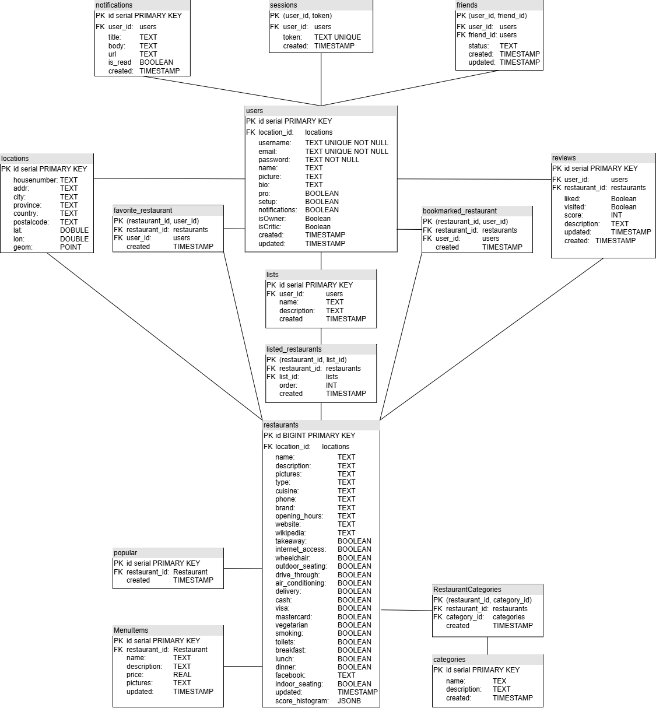

# Backend

# Endpoints
An end point in **BOLD** specifies it's implemented.

## /auth
**POST /register → Create a new user  
POST /login → Authenticate a user and generate a session token  
POST /logout → Invalidate the session token  
GET /me → get logged in user info  
POST /forgot-password → send an email with recovery code  
POST /reset-password → reset password with one time code  
GET /google → start oauth process  
GET /google/callback → finish oauth process**

## /categories
**GET / → Get all categories   
GET /:id → Get category details  
POST / → Create a new category**  

## /restaurants
**GET /     → get a collection of restaurants  
GET /search → search for restaurants given a query, and/or position data  
GET /:id    → get restaurant by specific ID**

## /reviews
**GET / → get logged in users reviews  
GET /:username → get reviews from specific user  
GET /restaurants/:restaurantId → get reviews from a restaurant  
POST / → create a new review for a given restaurant**

## /notifications
**GET / → Get all notifications from logged in user  
PUT /:id → Edit a notifications (ex: is_read)   
DELETE /:id → Delete a notifications**  

## /payments
GET /subscription → Get current users subscription status  
POST /create-subscription-session → Get link to launch a checkout page  
POST /create-portal-session → Get link to launch a manage subscription page  
POST /reactivate-subscription → Reactivate subscription renewal  
POST /cancel-subscription → Deactivate subscription renewal  
POST /webhook → Performs actions depending on what stripe sends  

## /status
GET / → Get API status

## /users
**GET / → Get logged in user profile and categories   
PUT / → Update logged in user profile  
DELETE / → Delete logged in user account  
GET /:id → Get specific user profile  
POST /upload → upload a profile picture  
GET /search → search for users given a query**

## /favourites
**GET / → get all favourited restaurants from logged in user  
GET /restaurants/:restaurant_id → get logged in user entry for specific restaurant  
GET /:username → get all favourited restaurants from user  
POST /:restaurant_id' → Add a favourites restaurant to logged in user  
DELETE /favourites/:restaurant_id → remove a favourites restaurant from logged in user**

## /bookmarks
**GET / → get all bookmarked restaurants
GET /:username → get all bookmarked restaurants from provided user   
POST /:restaurant_id' → Add a bookmark restaurant to logged in user  
DELETE /:restaurant_id → remove a bookmarked restaurant from logged in user**

## /friends
**GET / → get all friends of logged in user  
GET /:username → get all friends of specific user by username  
POST /:username → Add a friendship request from logged in user to provided user  
POST /:username/accept → Accept a friendship request from provided user  
POST /:username/deny → Deny a friendship request from provided user  
DELETE /:username → Remove a friend (provided user)**

## /lists
**GET / → get all lists of logged in user  
GET /recommended → get recommended lists  
GET /users/:username → get all lists of specific user by username  
GET /search → search for lists given a query  
GET /:id → Get specific lists information  
POST / → create a list  
PUT /:id → edit a list  
POST /:id/:restaurant_id → add restaurant to a list   
DELETE /:id/:restaurant_id → remove a restaurant from a list   
DELETE /:id → delete a list**

# Server Architecture

# Database

